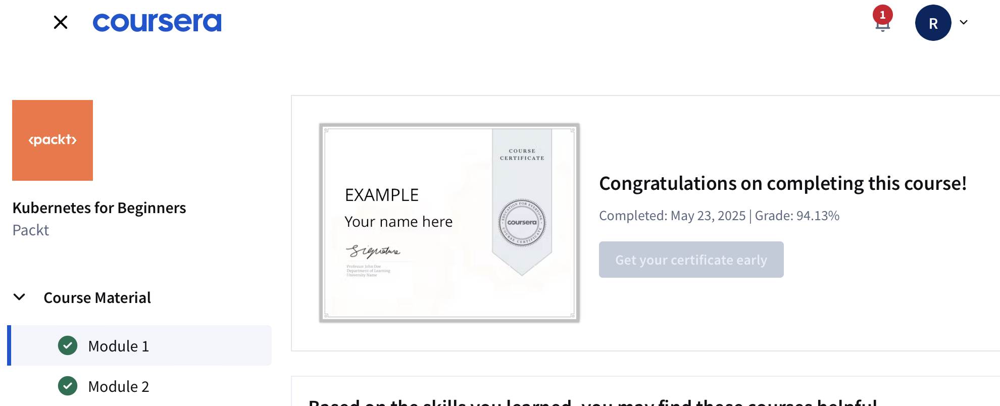

# SRE Study Notes

This repo includes key study materials as I learn and grow in Site Reliability Engineering (SRE) and DevOps practices.

---

## 📂 Files Included

- `k8s_notes.md`: Kubernetes beginner notes.
- `aws_notes.md`: Basic AWS study notes.
- `sre_troubleshooting.md`: Troubleshooting guide for network and service issues.

My Linux basics and shell scripting notes are maintained in a separate repository:

👉 [Linux Notes Repository](https://github.com/Ameliaannn/linux-notes.git)

---

## 📜 Course Certificate

I completed the **"Kubernetes for Beginners"** course from Packt on Coursera with a score of 94.13%:

